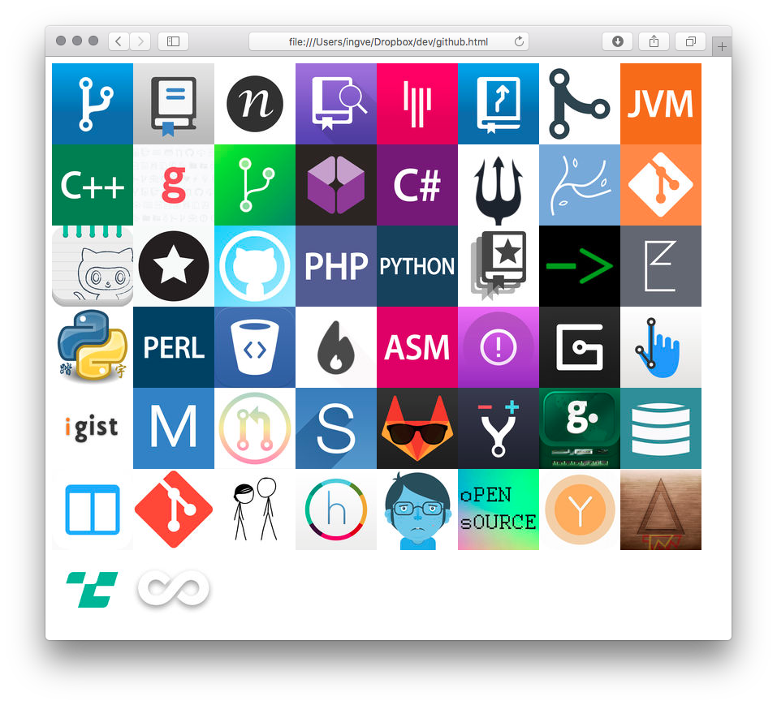

# ipics-cli [](https://travis-ci.org/ingve/ipics-cli)

> Search for thumbnails and images for Itunes media and open default browser to preview results.

## Install

```
$ npm install --global ipics-cli
```

## Usage

```
Usage
$ ipics <searchTerm>

Options
  -t, --type  Type of item to search for
  (can be one of 'album', 'book', 'ios-app', 'mac-app', 'movie' or 'tv-show')

Examples
  ipics OU812 -t album
  ipics "Twin Peaks" -t tv-show
```



## Related

- [ipics](https://github.com/ingve/ipics) - API for this module.

## License

MIT © 2016 [Ingve Vormestrand](https://github.com/ingve)
